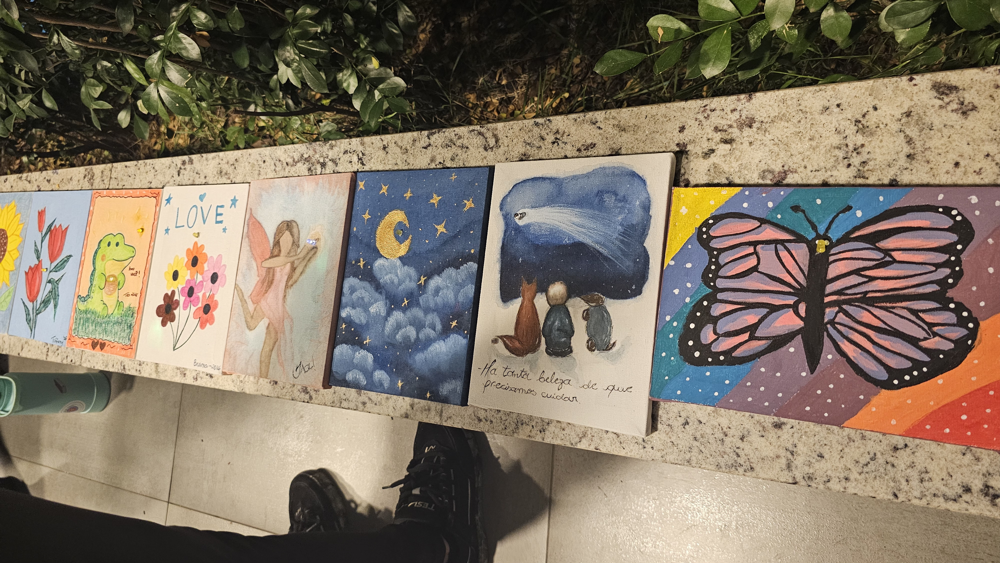

🇺🇸 English | 🇧🇷 [Português](README.pt.md)

  

# 🌸 Mother's Day Illuminated Canvases

A special project where participants build decorative canvases that come to life in the dark, combining handmade art and electronics in a light and affectionate way 💝
This project was developed for the Connect Byte Mother's Day workshop and introduces electronics concepts through a creative and meaningful experience.

## 🎨 Project Overview

In this project, participants create a decorative canvas with a built-in electronic circuit capable of reacting automatically to ambient light.

The proposal is to unite artistic creation and basic electronics into something that goes beyond decoration. During the day, the mother sees only the composition on the canvas (a painting, collage, or personalized message). At dusk or when the lights go out, a surprise element lights up on its own, revealing a new detail of the artwork.

## ✨ How the "Magic" Works

The heart of this project is an autonomous light detector circuit. Without buttons or manual triggers, an LDR sensor continuously monitors ambient lighting. As soon as the room gets dark, the circuit is automatically activated, releasing power from the battery and turning on the LED integrated into the art.

This luminous element can represent different details of the composition, creating a surprise effect on the canvas.

## 🧩 How We'll Integrate Art and Electronics

For the project to work best, it's essential that aesthetics and electronics work in harmony. The main points of attention for assembly are:

1. *Camouflage and positioning:* the circuit, battery, and wires are hidden on the back of the canvas, preserving the artistic appearance of the piece.

2. *The "Eye" of the canvas:* the LDR sensor, responsible for detecting ambient light, needs to be positioned in a strategic spot on the front of the canvas or on one of its edges to capture ambient light. Therefore, it cannot be completely covered by the art.

3. *The LED (surprise element):* the LED discreetly goes through the canvas from back to front to compose the art and create the luminous effect.

## 🛠️ Technical Summary for Assembly (Hardware)

The circuit was designed to be compact, safe, and low-voltage, requiring no wall outlet connection. The whole system works autonomously, ensuring practicality and safety for the decorative piece.

•   **Step-by-step:** Check the assembly instructions in the [assembly](docs/ASSEMBLY.md) guide.

•   **Circuit Simulation:** Simulate the circuit on the web at [Wokwi](https://wokwi.com/projects/463645117690066945).

•   **Workshop:** Watch our [workshop recording](https://www.youtube.com/watch?v=hPPSX-9uRHw) here. You can also check the code of the meeting [here](https://wokwi.com/projects/465207679102754817).

---

  

## Connect Byte
Website: https://connect-byte.org  
Linkedin: https://www.linkedin.com/company/connect-byte/  
Instagram: [@connectbyte_](https://www.instagram.com/connectbyte_)