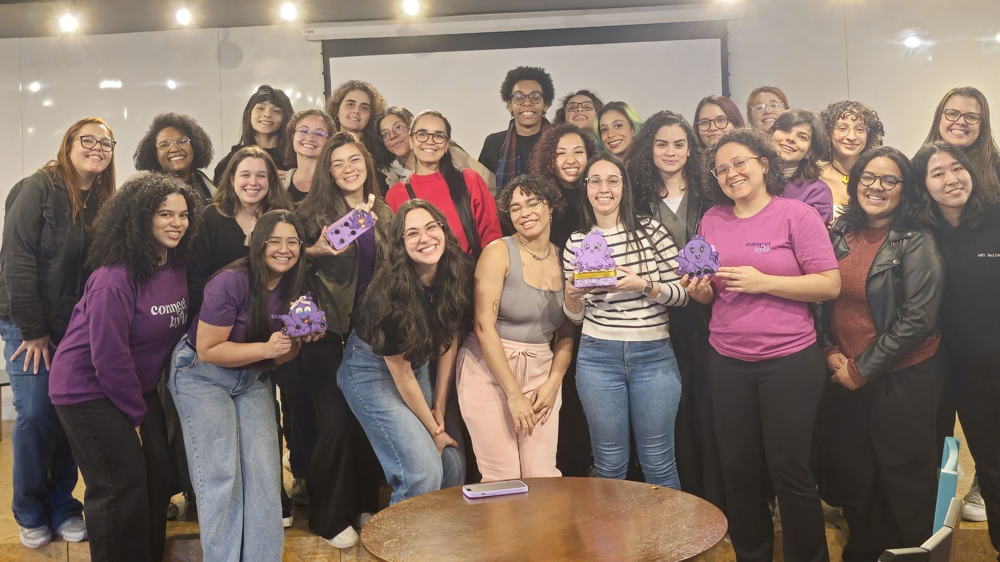
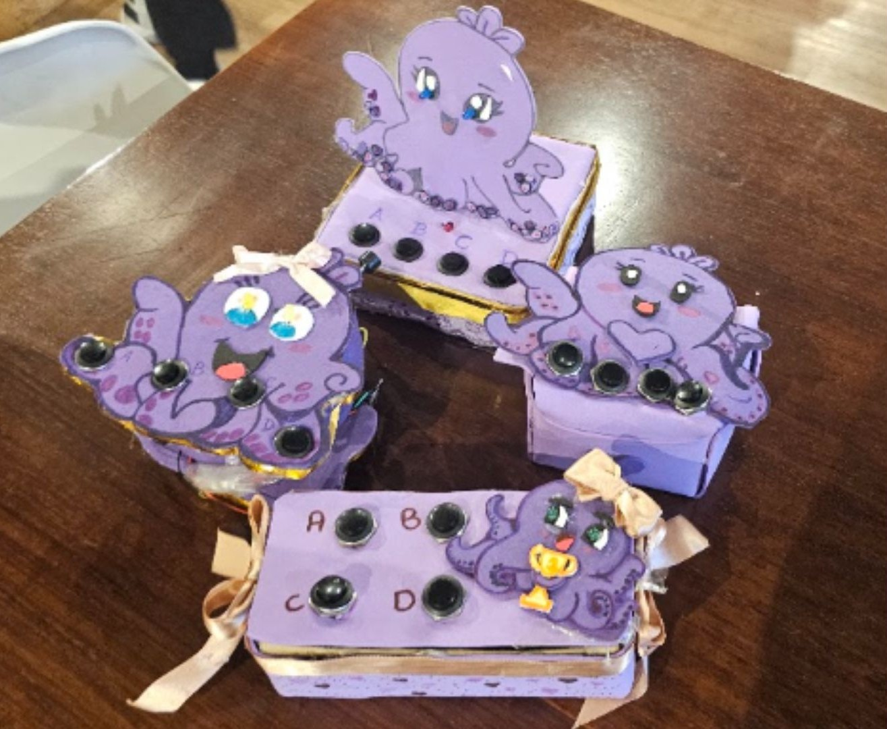

🇺🇸 [English](README.md) | 🇧🇷 Português

<p align="center">
  
</p>

# Byte do Milhão 💜🎮

Game show em tempo real da comunidade Connect Byte — Encontro de Junho (FIAP + MagaluCloud).

Usando ESP32 como controles remotos, backend Node.js com WebSocket e frontend Next.js gamificado.

🔗 [Projeto no Wokwi](https://wokwi.com/projects/465858648642294785)

---

## 🎮 Visão Geral do Projeto

O **Byte do Milhão** é um game show interativo para eventos ao vivo da comunidade Connect Byte. As participantes usam controles físicos com ESP32 para responder perguntas em tempo real, com placar atualizado ao vivo e feedback imediato na tela.

<p align="center">
  
</p>

---

## 🗂️ Estrutura

- `backend`: Express + Socket.IO + TypeScript, com estado persistido em PostgreSQL.
- `frontend`: Next.js + React + TypeScript + Tailwind CSS.
- `esp32-controller`: firmware PlatformIO/Arduino para ESP32 com botões físicos.
- `docs`: exemplos de integração ESP32.

---

## 🎯 Fluxo do Jogo

1. Abra a Arena.
2. Cadastre uma pergunta real.
3. Clique em **Iniciar**.
4. Envie respostas via ESP32.
5. Clique em **Encerrar**.
6. Clique em **Revelar**.
7. Veja ranking e relatório.

---

## 🔌 Endpoints Principais

| Método | Rota | Descrição |
|--------|------|-----------|
| `GET` | `/health` | Healthcheck |
| `GET` | `/state` | Estado atual do jogo |
| `POST` | `/devices/register` | Registrar dispositivo |
| `POST` | `/devices/heartbeat` | Heartbeat do dispositivo |
| `POST` | `/questions` | Cadastrar pergunta |
| `POST` | `/answers` | Enviar resposta |
| `POST` | `/game/start` | Iniciar jogo |
| `POST` | `/game/next-question` | Próxima pergunta |
| `POST` | `/game/close-question` | Encerrar pergunta |
| `POST` | `/game/reveal-question` | Revelar resposta |
| `POST` | `/game/reset` | Resetar jogo |
| `GET` | `/report` | Relatório final |

---

## 📦 Payloads de Exemplo

**Cadastrar pergunta:**
```json
{
  "text": "Qual protocolo é muito usado em IoT?",
  "options": {
    "A": "SMTP",
    "B": "MQTT",
    "C": "FTP",
    "D": "LDAP"
  },
  "correctAnswer": "B",
  "durationSeconds": 30
}
```

**ESP32 — resposta:**
```json
{
  "deviceId": "esp32-07",
  "answer": "B"
}
```

**ESP32 — heartbeat:**
```json
{
  "deviceId": "esp32-07"
}
```

---

## 📡 Socket.IO

**Eventos emitidos pelo servidor:**

- `device:online` / `device:offline`
- `answer:received`
- `question:started` / `question:closed` / `question:revealed`
- `ranking:updated`
- `narrator:message`
- `metrics:updated`
- `report:generated`

**Eventos enviados pelo cliente:**

- `dashboard:join`
- `host:start-question`
- `host:close-question`
- `host:reveal-question`

---

## 🏆 Pontuação

| Condição | Pontos |
|----------|--------|
| Resposta correta | +100 |
| Até 2s | +50 |
| Até 5s | +30 |
| Até 10s | +10 |
| Sequência ≥ 3 | +25 |
| Bônus MVP da rodada | +25 |
| Resposta errada | 0 |

---

## 🔧 Testar com ESP32 Físico

O projeto do controle está em `esp32-controller`. Veja o guia passo a passo em [`docs/esp32-platformio.md`](docs/esp32-platformio.md).

Para trabalhar no VS Code, abra o workspace:

```text
byte-do-milhao.code-workspace
```

Exemplo com `curl`:

```bash
curl -X POST http://localhost:4000/answers \
  -H "Content-Type: application/json" \
  -d '{"deviceId":"esp32-07","answer":"B"}'
```

---

## Connect Byte
Website: https://connect-byte.org  
LinkedIn: https://www.linkedin.com/company/connect-byte/  
Instagram: [@connectbyte_](https://www.instagram.com/connectbyte_)
